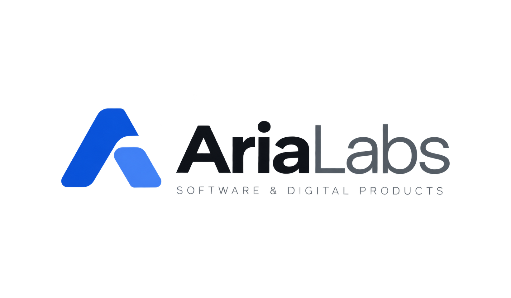

 

### We build software for real-world businesses.

Modern, practical and accessible digital products — designed to simplify complex processes through 
thoughtful design, reliable technology and automation.

 

 

## 🚀 Our Products

<table>
  <tr>
    <td width="50%" valign="top">
      <h3>🌙 Umbral</h3>
      
<b>Events & ticketing platform</b> built for modern nightlife and events.

      

        
        
        
      

    </td>
    <td width="50%" valign="top">
      <h3>⚡ Pulso</h3>
      
<b>Multi-tenant business management</b> for entrepreneurs and small businesses.

      
Sales, inventory and electronic invoicing in one simple experience.

      

        
        
        
      

    </td>
  </tr>
</table>

 

## 🧭 How We Build

Software should be:

| | Principle | What it means |
|:-:|:--|:--|
| 🎯 | **Simple** | Complexity belongs in the system, not in the user's head. |
| 🧩 | **Modular** | Products grow without becoming difficult to maintain. |
| 📈 | **Scalable** | Architecture supports growth without premature complexity. |
| 🤝 | **Human** | Technology feels approachable, even for non-technical people. |
| 💡 | **Thoughtful** | Every feature has a reason to exist. |

 

## 🛠️ Our Approach

We use modern technologies and **AI-assisted development** to build and iterate efficiently, while keeping **architecture, quality and maintainability** at the center of everything we ship.

 

**AriaLabs** · *Technology with purpose.*

